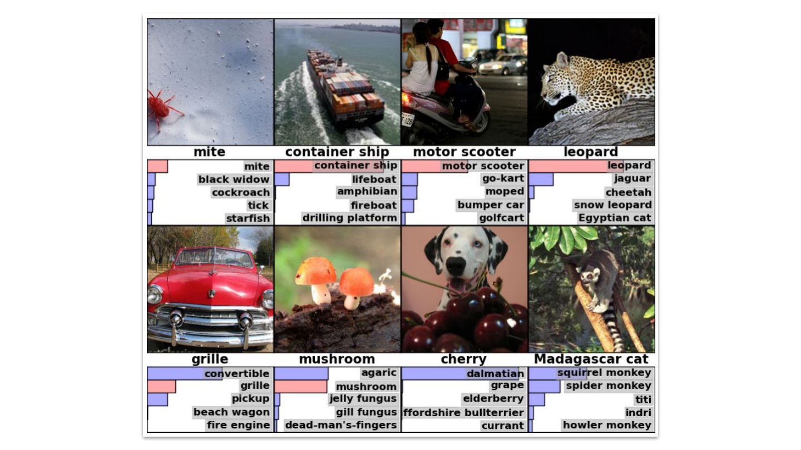

# Deep Learning Overview

  <time datetime="2026-01-18">18 Jan 2026</time> ·
  <time datetime="PT9M">9 min</time>

**Artificial Intelligence (AI)** is the broad field concerned with building systems that perform tasks requiring intelligence. **Machine Learning (ML)** is a subfield of AI that enables systems to learn patterns and make decisions from data rather than explicit rules. **Deep Learning (DL)** is a subfield of ML that uses multi-layer neural networks to learn complex representations from large datasets.

  
Note

  

    The following sources were used in preparing this text:
  

  <ul>
    <li style="margin-bottom: 0">
      Goodfellow, I., Bengio, Y., &amp; Courville, A. (2016).
      <a href="https://www.deeplearningbook.org/contents/intro.html" target="_blank" rel="noopener">Deep Learning</a>. MIT Press.   
    </li>
    <li style="margin-bottom: 0">
      Schmidhuber, J. (2015).
      <a href="https://people.idsia.ch/~juergen/deep-learning-history.html" target="_blank" rel="noopener">Deep Learning in Neural Networks: An Overview.
      </a>Neural Networks.
    </li>
    <li style="margin-bottom: 0">
      Zhang, A., Lipton, Z. C., Li, M., &amp; Smola, A. J.
     <a href="https://d2l.ai/chapter_introduction/index.html" target="_blank" rel="noopener">Dive into Deep Learning</a>. d2l.ai.
  </ul>

## AI / ML / DL

AI initially focused on what is often called the knowledge-based approach, where intelligence was treated as something that could be explicitly written down. Researchers attempted to encode reasoning as rules, symbols, and logical statements. If a human expert knew how to solve a problem, the reasoning steps would be formalized and executed by a machine.

This approach failed when faced with the ambiguity and variability of the real world. Tasks that humans perform effortlessly, such as recognizing faces or understanding speech, are precisely the tasks that are hardest to describe step by step. Human expertise in these domains is largely implicit rather than explicit. Rule-based systems therefore became brittle, difficult to scale, and expensive to maintain. Small changes in the environment often required rewriting large portions of the system, making progress slow and fragile.

<figure>
  
  <figcaption style="margin-top: 0.5em; font-size: 0.9em; opacity: 0.85;">
    Deep Learning and AI ~ Goodfellow, I., Bengio, Y., & Courville, A. (2016). <a href='http://www.deeplearningbook.org'>Deep Learning</a>. MIT Press. 
  </figcaption>
</figure>

ML offered a different perspective. Instead of programming intelligence directly, machines were allowed to **learn patterns from data**. Classical ML algorithms such as linear models, logistic regression, naïve Bayes, and decision trees achieved real success in applications like medical decision support, spam filtering, and credit scoring. However, these methods relied heavily on hand-crafted features. Human designers had to decide in advance which properties of the data were relevant, and performance depended more on feature design than on the learning algorithm itself.

This reliance on features became a serious limitation as data grew more complex. Images, audio signals, and language live in very high-dimensional spaces. In such spaces, intuition breaks down, a phenomenon often referred to as the [curse of dimensionality](https://en.wikipedia.org/wiki/Curse_of_dimensionality). As dimensionality increases, data becomes sparse, distances lose their meaning, and small modeling assumptions can cause large failures. Feature engineering becomes brittle and does not scale to the richness of real-world data.

The natural response to this problem was [representation learning](https://en.wikipedia.org/wiki/Feature_learning). Instead of manually defining features, the model learns useful representations directly from raw data. Early methods such as [Principal Component Analysis (PCA)](https://en.wikipedia.org/wiki/Principal_component_analysis), kernel methods, sparse coding, and shallow neural networks pursued this idea. They demonstrated that learning intermediate representations could significantly improve performance and reduce reliance on handcrafted features. However, these approaches were typically shallow, consisting of only one or two layers of transformation. As a result, they struggled to capture the hierarchical structure present in real-world data.

Many perceptual tasks are inherently *compositional*. Images are composed of edges, edges form textures and parts, parts form objects, and objects form scenes. Speech and language exhibit similar hierarchies. Shallow models can learn simple transformations, but they cannot efficiently represent such multi-level abstractions. Attempting to do so requires an exponential number of features or parameters, making learning unstable and data-inefficient. In practice, representation learning without depth hit a ceiling: it reduced feature engineering, but it could not scale to the complexity of vision, speech, and language.

DL extends representation learning by stacking many layers of nonlinear transformations. Each layer learns to represent the data at a higher level of abstraction, allowing complex structures to be built incrementally. 

At a fundamental level, both classical ML and DL do the same thing: they **learn a function from data**. The difference is not in what is learned, but in how much of the function is learned automatically. In all cases, learning amounts to selecting parameters so that a function best approximates the desired input–output relationship under a given objective.

Interestingly, DL did not introduce fundamentally new mathematical ideas. Many concepts, such as multi-layer neural networks, backpropagation, gradient-based optimization, and even convolutional architectures were known decades earlier. 

## Biological and Artificial Neurons

DL is **not** an attempt to simulate the brain. [Artificial neural networks](https://en.wikipedia.org/wiki/Neural_network_(machine_learning)) are inspired by biological neurons, but the resemblance is conceptual rather than literal. 

<figure>
  
  <figcaption style="margin-top: 0.5em; font-size: 0.9em; opacity: 0.85;">
      Structure of a typical neuron with Schwann cells in the peripheral nervous system ~ "Anatomy and Physiology" by the US National Cancer Institute's Surveillance | <a href='https://creativecommons.org/licenses/by-sa/3.0/'>CC BY-SA 3.0</a> | <a href='https://commons.wikimedia.org/wiki/File:Neuron.svg#/media/File:Neuron.svg'>Wikimedia Commons</a>
  </figcaption>
</figure>

A [biological neuron](https://en.wikipedia.org/wiki/Neuron) is a living cell designed for communication in a noisy, energy-constrained environment. It receives signals through *dendrites*, integrates them in the *soma* (cell body), and, if a threshold is reached, sends an electrical pulse along the *axon* to other neurons through *synapses*. Learning occurs locally by strengthening or weakening synaptic connections through repeated interaction with the environment.

<figure>
  
  <figcaption style="margin-top: 0.5em; font-size: 0.9em; opacity: 0.85;">
      Artificial Neuron ~ Funcs, Own work | <a href='https://creativecommons.org/public-domain/cc0/'>CC0</a> | <a href='https://commons.wikimedia.org/w/index.php?curid=148910507'>Wikimedia Commons</a>
  </figcaption>
</figure>

An artificial neuron is a mathematical function that combines numerical inputs and produces a numerical output. Much like how airplanes were inspired by birds but rely on entirely different aerodynamic mechanisms, the success of DL does not come from biological realism. Biological systems served primarily as inspiration.

## Evolution of Deep Learning

Learning from data predates computers. The mathematical backbone of modern deep learning is the [chain rule](https://en.wikipedia.org/wiki/Chain_rule), formalized by Gottfried Wilhelm Leibniz and later exploited by backpropagation algorithms. Carl Friedrich Gauss and Adrien-Marie Legendre used [linear regression](https://en.wikipedia.org/wiki/Linear_regression) in the early nineteenth century, a method mathematically equivalent to a shallow neural network. In the mid-twentieth century, researchers such as Warren McCulloch and Walter Pitts, Frank Rosenblatt, and Bernard Widrow explored learning machines inspired by biological neurons. These early systems were limited—often linear or single-layer—and constrained by the theory and hardware of their time.

Multi-layer learning systems already existed by the 1960s and 1970s. Alexey Ivakhnenko and Valentin Lapa trained models with adaptive hidden layers, while Kunihiko Fukushima introduced the Neocognitron, a hierarchical, convolution-like architecture that anticipated modern convolutional networks.

But why did DL become popular only after the 2010s? The obstacle was never the lack of a correct algorithm. It was the lack of data and the cost of computation. DL worked because three forces aligned. Data became abundant because digital life produces it automatically. Computation became affordable because parallel hardware matured. And (less critically) software matured enough to make experimentation fast and scalable.

## Data

The modern era began when data stopped being rare. This shift was driven by broader technological changes. Digital sensors replaced analog ones, smartphones placed cameras and microphones in billions of pockets, and the internet enabled continuous sharing of images, text, audio, and video. Companies began logging user interactions by default, storage became cheap, and bandwidth increased dramatically. Data was no longer collected deliberately, it was generated automatically as a byproduct of everyday life.

Before large-scale datasets became feasible, progress relied on small, carefully curated benchmarks. The famous [MNIST](https://en.wikipedia.org/wiki/MNIST_database) dataset was collected by the [National Institute of Standards and Technology](https://www.nist.gov/) (NIST), and later was modified (hence the M before NIST) for simpler usage of ML algorithms[^2]. MNIST is a simple dataset of handwritten digits that allowed researchers to isolate questions about optimization, architectures, and learning dynamics without the confounding effects of scale and noise. 

<figure>
  
  <figcaption style="margin-top: 0.5em; font-size: 0.9em; opacity: 0.85;">
    MNIST inputs ~ Goodfellow, I., Bengio, Y., & Courville, A. (2016). <a href='http://www.deeplearningbook.org'>Deep Learning</a>. MIT Press. 
  </figcaption>
</figure>

A symbolic moment was the creation of [ImageNet](https://www.image-net.org/) (Deng et al.). ImageNet contained roughly 14 million labeled images, with about 1.2 million training images across 1,000 categories used in its main benchmark. This scale exposed the limitations of hand-crafted features. Models that performed well on small datasets failed to generalize, while systems capable of learning representations directly from data improved reliably.

In 2012, [AlexNet](https://proceedings.neurips.cc/paper_files/paper/2012/file/c399862d3b9d6b76c8436e924a68c45b-Paper.pdf) (Krizhevsky et al.) won the ImageNet competition by a large margin. The model was unusually large and computationally demanding, and training it required GPUs rather than CPUs. This detail is crucial. DL did not succeed merely because sufficient data became available, it succeeded because the models finally fit within the limits of available hardware.[^1]

<figure>
  
  <figcaption style="margin-top: 0.5em; font-size: 0.9em; opacity: 0.85;">
   "Eight ILSVRC-2010 test images and the five labels considered most probable by our model. The correct label is written under each image, and the probability assigned to the correct label is also shown with a red bar (if it happens to be in the top 5)." ~ Krizhevsky, A., Sutskever, I., & Hinton, G. E. (2012). <a href='https://proceedings.neurips.cc/paper_files/paper/2012/file/c399862d3b9d6b76c8436e924a68c45b-Paper.pdf'>ImageNet Classification with Deep Convolutional Neural Networks</a>. Advances in Neural Information Processing Systems (NeurIPS)  
  </figcaption>
</figure>

> As of 2016, a rough rule of thumb is that a supervised deep learning algorithm will generally achieve acceptable performance with around 5,000 labeled examples per category and will match or exceed human performance when trained with a dataset containing at least 10 million labeled examples.  
>  
> _[Deep Learning  (Chapter I)](https://shahaliyev.org/writings/intro-deep-learning) ~ Goodfellow, I., Bengio, Y., & Courville, A. (2016). MIT Press._

## Hardware

Training neural networks is dominated by large-scale numerical operations repeated many times. CPUs are optimized for general-purpose tasks and complex control flow, but they are inefficient for massive parallel arithmetic. [GPUs](https://www.youtube.com/watch?v=h9Z4oGN89MU), originally designed for rendering images, apply the same operation to many data points simultaneously. This made them a natural fit for neural network training.

[NVIDIA](https://www.nvidia.com/en-us/) became central to DL because it invested early in programmable GPUs and the software needed to exploit them. Although originally developed for video games, GPUs are fundamentally optimized for massively parallel linear algebra, especially matrix and tensor operations. The introduction of [CUDA](https://en.wikipedia.org/wiki/CUDA) exposed this capability to researchers, making large-scale matrix multiplications—the core computational workload of neural networks—efficient and accessible. As a result, models that once took weeks to train on CPUs could be trained in days or hours. Later accelerators such as Tensor Processing Unit (TPU) followed the same principle: DL scales when hardware is designed around dense linear algebra, high memory bandwidth, and parallel computation.

## Software

The relevant software emerged in parallel with hardware. [Python](https://www.python.org/) became the dominant language for ML because it allowed researchers to write clear, concise code while delegating computationally intensive operations to highly optimized numerical libraries implemented in C, C++, and CUDA. This separation between high-level model logic and low-level performance-critical kernels proved decisive. Researchers could focus on ideas rather than infrastructure, iterating rapidly while still benefiting from efficient linear algebra routines running on GPUs.

Modern DL frameworks such as [PyTorch](https://pytorch.org/) and [TensorFlow](https://www.tensorflow.org/) made it possible to automate differentiation, memory management, and efficient parallel execution. As a result, experiments that once required weeks of careful implementation could be expressed in hundreds of lines of code and tested within days.

PyTorch is primarily a tool for research and experimentation. It is designed to feel like ordinary Python code, which makes models easy to write, modify, and debug. Tools such as [PyTorch Lightning](https://lightning.ai/docs/pytorch/stable/) build on this flexibility by handling routine tasks like training loops and logging, allowing users to keep their focus on the model itself.

TensorFlow, on the other hand, is more strongly oriented toward engineering and deployment. It was built to support large systems that need to run reliably across different machines and environments. With the addition of [Keras](https://keras.io/), TensorFlow offers a high-level interface that makes it easy to define standard models and training pipelines in a consistent way. This structure is well suited to production settings, where models must be maintained, scaled, and deployed efficiently over long periods of time.

## Transformers and Beyond

**Computer Vision (CV)** and **Natural Language Processing (NLP)** are the two main perception-oriented branches of modern DL. Both aim to convert raw, high-dimensional signals into structured representations that machines can reason over, but they operate on different data modalities and evolved under different constraints.

CV focuses on visual data such as images and videos. Early progress was driven by convolutional neural networks (CNN). NLP deals with sequential, symbolic data such as text and speech. While early neural NLP relied on recurrent models (RNN), a major conceptual shift occurred with the introduction of the [Transformer architecture](https://proceedings.neurips.cc/paper_files/paper/2017/file/3f5ee243547dee91fbd053c1c4a845aa-Paper.pdf) (Vaswani et al., 2017), which replaced sequential recurrence with attention-based information routing. This change enabled massive **parallelism**, better long-range dependency modeling, and effective scaling with data and compute. The same architecture was later adapted to images via [Vision Transformers](https://arxiv.org/pdf/2010.11929) (Dosovitskiy et al., 2020), revealing that vision and language could share a common computational backbone despite their different input structures.

DL also extended beyond perception into decision-making. The combination of deep learning and [reinforcement learning](https://en.wikipedia.org/wiki/Reinforcement_learning) became widely visible through [AlphaGo](https://discovery.ucl.ac.uk/id/eprint/10045895/1/agz_unformatted_nature.pdf) and later [AlphaZero](https://arxiv.org/pdf/1712.01815) (Silver et al., 2016; 2018), which learned complex games through self-play without human examples.

Building on the Transformer architecture, [Large Language Models](https://en.wikipedia.org/wiki/Large_language_model) (LLM) such as Generative Pre-trained Transformer (GPT) marked a shift from task-specific NLP systems to general-purpose [foundation models](https://en.wikipedia.org/wiki/Foundation_model). By training a model on massive text corpora, GPT-style models learn broad linguistic, semantic, and world-level regularities that can be reused across tasks. Their success demonstrated that scale—data, parameters, and compute—can replace handcrafted linguistic structure, and that a single architecture can support a wide range of capabilities, including translation, summarization, reasoning, and code generation, without explicit task-specific design.

[^1]: Even then, [Alex Krizhevsky](https://www.cs.toronto.edu/~kriz/) had to distribute training across two NVIDIA GeForce GTX 580 GPUs, each with 3 GB of memory (best at the moment), because the network did not fit on a single GPU.

[^2]: [Geoffrey Hinton](https://www.cs.toronto.edu/~hinton/) called this dataset "the drosophila of ML", a fruit fly extensively used in genetic research labs.