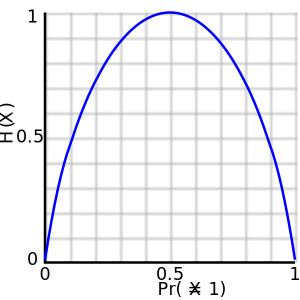

# Information Theory

  <time datetime="2026-02-09">9 Feb 2026</time> /
  <time datetime="2026-03-30">30 Mar 2026</time>

[Information theory](https://en.wikipedia.org/wiki/Information_theory) is the mathematical framework for measuring how much *uncertainty* or *information* is contained in a probability distribution. While [probability theory](../03_probability) tells us how to represent uncertainty, information theory tells us how to *quantify* it. In [deep learning](../../introduction/01_deep_learning), information theory appears everywhere: in loss functions, in [regularization](../../notebooks/04_regul_optim), in [probabilistic modeling](../mathematics/05_prob_modeling), and in the general idea of compressing data into meaningful representations.

!!! info
    The following source was consulted in preparing this material: Goodfellow, I., Bengio, Y., & Courville, A. (2016). *Deep Learning*. MIT Press. [Chapter 3: Probability and Information Theory](https://www.deeplearningbook.org/contents/prob.html).

!!! warning "Important"
    Some concepts in this material are simplified for pedagogical purposes. These simplifications slightly reduce precision but preserve the core ideas relevant to deep learning.

!!! note
    Information theory was established by [Claude Shannon](https://en.wikipedia.org/wiki/Claude_Shannon) in his famous 1948 paper [A Mathematical Theory of Communication](https://people.math.harvard.edu/~ctm/home/text/others/shannon/entropy/entropy.pdf), where he introduced the idea that information can be measured quantitatively, just like mass or energy. Shannon originally developed the theory to study how efficiently messages can be transmitted through noisy communication channels (e.g. radio). Today, the same mathematical tools are fundamental in deep learning, because training a model often means minimizing uncertainty and compressing information into useful representations.

## Self-Information

The core idea of information theory is simple: _Learning that an unlikely event happened gives more information than learning that a likely event happened._ 

!!! example
    Learning that "the sun rose today" is not informative, but learning that "a solar eclipse happened today" is informative.

Shannon proposed that any measure of information should satisfy three basic properties:

1. Certainty carries no information. If $P(x)=1$, then the event is fully predictable, so its information should be $0$.
2. Rarer events are more informative. if $P(x)$ decreases, the information should increase.
3. Independent information is additive. if two independent events occur, the total information should be the sum of their individual information.

To measure this idea mathematically, we want a quantity that behaves like **surprise**: If an event is very likely, it should have low surprise, and vice versa. We can define surprise as inversely proportional to probability:
$$
S(x) \propto \frac{1}{P(x)}.
$$

This captures the basic intuition: rare events (small $P(x)$) produce large surprise, while common events produce small surprise. However, this definition has a problem. If two independent events $x$ and $y$ occur, their joint probability is $P(x,y) = P(x)P(y)$, so their surprise would become:
$$
S(x,y) \propto \frac{1}{P(x)P(y)} = \frac{1}{P(x)} \cdot \frac{1}{P(y)},
$$
which multiplies rather than adds. If two independent events occur, their probabilities multiply, so their surprise would multiply as well. But we defined that information from independent events should accumulate additively, not multiplicatively. To convert multiplication into addition, there is a common trick in probability theory: take the logarithm. Using the identity $\log(1/u)=-\log(u)$, we obtain the [self-information](https://en.wikipedia.org/wiki/Information_content) (also called *surprisal*, *information content*, or *Shannon information*) of an event $X=x$, which satisfies all three key properties defined by Shannon:
$$
I(x) = -\log P(X=x).
$$

!!! note
    In this course, $\log$ always means the natural logarithm (base $e$). When using natural logs, information is measured in _nats_ rather than bits. There are excpetions (e.g. [t-SNE](../../supplementary/tsne)), naturally.

!!! warning "Important"
    From the infamous [vanishing gradient problem](../../notebooks/04_regul_optim/#exploding-vanishing-gradients), recall that multiplying probabilities quickly produces extremely small numbers. For example, if we observe $100$ independent events each with probability $0.01$, then the joint probability $p(x_{1:100})$ is $(0.01)^{100} = 10^{-200}$, which is essentially zero in floating-point arithmetic. This causes numerical underflow and also leads to very small gradients when optimizing likelihoods directly. Taking the logarithm fixes this problem:
    $$
    \log (0.01^{100})
    =
    100 \log(0.01)
    \approx
    -460.5,
    $$
    which is a normal-sized number. This is why deep learning almost always optimizes log-likelihood instead of likelihood: products become sums, computations stay stable, and gradients remain usable.

## Entropy

Self-information measures the surprise of a single outcome. But often we want a single number that summarizes the uncertainty of an entire distribution. In information theory, the (Shannon) [entropy](https://en.wikipedia.org/wiki/Entropy_(information_theory)) of a discrete random variable $X$ is the expected self-information:

$$
H(X)
=
\mathbb{E}[I(X)]
=
-\sum_x P(X=x)\log P(X=x).
$$

It implies that if $X$ is almost always the same value, there is little uncertainty, so entropy is low. If $X$ has many equally likely outcomes, uncertainty is high, so entropy is high.

<figure>
  
  <figcaption style="margin-top: 0.5em; font-size: 0.9em; opacity: 0.85;">
    Entropy $Η(X)$ (i.e. the expected surprisal) of a coin flip, measured in bits, graphed versus the bias of the coin $Pr(X = 1)$, where X = 1 represents a result of heads. Here, the entropy is at most 1 bit, and to communicate the outcome of a coin flip (2 possible values) will require an average of at most 1 bit (exactly 1 bit for a fair coin). The result of a fair die (6 possible values) would have entropy $\log_2 6$ bits. ~ <a href="//commons.wikimedia.org/wiki/File:Binary_entropy_plot.png" title="File:Binary entropy plot.png">Original: </a> <a href="//commons.wikimedia.org/wiki/User:Brona" title="User:Brona">Brona</a> Vector: <a href="//commons.wikimedia.org/wiki/User:Alejo2083" title="User:Alejo2083">Alessio Damato</a>Newer version by <a href="//commons.wikimedia.org/wiki/User:Krishnavedala" title="User:Krishnavedala">Rubber Duck</a> - Own work based on: <a href="//commons.wikimedia.org/wiki/File:Binary_entropy_plot.png" title="File:Binary entropy plot.png">Binary entropy plot.png</a>&nbsp;by <a href="//commons.wikimedia.org/wiki/User:Brona" title="User:Brona">Brona</a>, <a href="http://creativecommons.org/licenses/by-sa/3.0/" title="Creative Commons Attribution-Share Alike 3.0">CC BY-SA 3.0</a>, <a href="https://commons.wikimedia.org/w/index.php?curid=1984868">Link</a>
  </figcaption>
</figure>

!!! note
    Entropy is maximized by the uniform distribution. If $X$ takes $k$ outcomes with equal probability $P(X=i)=1/k$, then:
    $$
    H(X)
    =
    -\sum_{i=1}^{k}\frac{1}{k}\log\frac{1}{k}
    =
    \log k.
    $$
    This matches intuition: choosing among more equally likely options is more uncertain.

!!! example
    Consider a Bernoulli random variable $X\sim \mathrm{Bernoulli}(\phi)$:
    $$
    P(X=1)=\phi,\qquad P(X=0)=1-\phi.
    $$
    Its entropy is:
    $$
    H(X)
    =
    -\phi\log\phi-(1-\phi)\log(1-\phi).
    $$
    This entropy is highest at $\phi=0.5$ (maximum uncertainty) and approaches $0$ as $\phi\to 0$ or $\phi\to 1$ (almost no uncertainty).

Discrete entropy is always nonnegative: $H(X)\ge 0.$ [Differential (continuous) entropy](https://en.wikipedia.org/wiki/Differential_entropy) measures uncertainty in a continuous distribution, but it behaves differently from discrete entropy. This happens because $p(x)$ is a probability *density*, not a probability. A density can be greater than $1$, so $\log p(x)$ can be positive. Hence, differential entropy can be negative. For a continuous random variable with density $p(x)$, the differential entropy is:
$$
H(X)
=
-\int p(x)\log p(x)\,dx.
$$

!!! note
    In a continuous distribution, the probability of any exact value is zero $P(X = x) = 0$. This means that self-information $-\log P(X=x)$ is not well-defined for individual outcomes. As a result, differential entropy is not the expected surprisal of exact values, but rather a quantity derived from the probability *density*. For a small region of width $\Delta x$, the probability is approximately:
    $$
    P(x \le X \le x+\Delta x) \approx p(x)\,\Delta x.
    $$
    
    From the [fundamental theorem of calculus](../01_calculus/#fundamental-theorem-of-calculus), the information associated with this event is:
    $$
    -\log\big(p(x)\,\Delta x\big) = -\log p(x) - \log \Delta x.
    $$
    
    Averaging over all such small intervals leads to the differential entropy expression.

Another important difference is that differential entropy depends on the units of measurement. This happens because it is defined in terms of a probability density, which changes when we rescale the variable. Suppose we scale a continuous variable by a factor $a>0$, defining $Y = aX$. Then the density must adjust to preserve total probability, and the entropy transforms as:
$$
H(Y) = H(X) + \log a.
$$

!!! success "Exercise"
    Show that $H(Y)=H(X)+\log a$. *Hint:* use the transformed density $p_Y(y)=\frac{1}{a}p_X(y/a)$ and apply a change of variables in the entropy integral.

The dependence on units arises because differential entropy implicitly measures uncertainty relative to a resolution of measurement. When we rescale the variable, we also change this resolution, which shifts the entropy value. This means that simply changing units (for example, from meters to centimeters) shifts the entropy by a constant. Therefore, unlike discrete entropy, differential entropy is not an absolute measure of uncertainty.

!!! example
    Let $X \sim U(0,1)$, so $p(x)=1$ on $[0,1]$. Then $H(X) = 0$. Now define $Y = 0.1X$, so $Y \sim U(0,0.1)$ and $p(y)=10$. Then $H(Y) = -\log(10)$. Although the entropy decreases, this does not indicate a reduction in uncertainty. It reflects that the distribution has been compressed into a smaller range, increasing the density and changing the coordinate scale.

## Conditional Entropy

Sometimes uncertainty about a variable is reduced after observing another variable. The [conditional entropy](https://en.wikipedia.org/wiki/Conditional_entropy) measures how much uncertainty about $X$ remains after we observe $Y$. A useful way to understand this is to consider each possible value of $Y$. If we observe $Y=y$, then $X$ follows the conditional distribution $P(X \mid Y=y)$, which has its own entropy $H(X \mid Y=y)$. The conditional entropy averages this remaining uncertainty over all possible values of $Y$:
$$
H(X \mid Y) = \sum_y P(y)\,H(X \mid Y=y).
$$

Equivalently, it can be written as:
$$
H(X \mid Y)
=
-\sum_{x,y} P(x,y)\log P(x \mid y),
$$
which expresses the expected surprisal of $X$ given $Y$. If $X$ is completely determined by $Y$, then there is no uncertainty left, so $H(X\mid Y)=0$. If $X$ and $Y$ are independent, then observing $Y$ does not change the distribution of $X$, so $H(X\mid Y)=H(X)$.

## Cross-Entropy

Entropy $H(P)$ measures the uncertainty of a distribution $P$. In deep learning, we usually have two distributions:

- The *true* (data) distribution $P$ that generates labels.
- A *model* distribution $Q$ that tries to predict them.

[Cross-entropy](https://en.wikipedia.org/wiki/Cross-entropy) measures the expected number of _nats_ needed to encode outcomes generated by the true distribution $P$, when we use an encoding scheme (e.g. [neural network](../../notebooks/02_neural_network)) that assumes the distribution is $Q$. In other words, it measures how well $Q$ predicts samples coming from $P$. If $Q$ assigns low probability to events that happen frequently under $P$, the cross-entropy becomes large.
$$
H(P,Q)
=
-\sum_x P(x)\log Q(x).
$$

Compare this with entropy. The only difference is what appears inside the logarithm: entropy uses the true distribution $P$, while cross-entropy uses the model distribution $Q$.

!!! example
    Suppose $X$ represents the outcome of a biased coin, and the true distribution is:
    $$
    P(X=\text{heads}) = 0.9,
    \qquad
    P(X=\text{tails}) = 0.1.
    $$

    The entropy of the true distribution is:
    

    $$
    H(P)
    =
    -0.9\log(0.9) - 0.1\log(0.1)
    \approx
    0.325 \text{ nats}.
    $$
    

    Now suppose we build a wrong model $Q$ that assumes the coin is fair:
    $$
    Q(X=\text{heads}) = 0.5,
    \qquad
    Q(X=\text{tails}) = 0.5.
    $$

    The cross-entropy of $P$ relative to $Q$ is:
    

    $$
    H(P,Q)
    =
    -0.9\log(0.5) - 0.1\log(0.5)
    =
    -\log(0.5)
    =
    \log 2
    \approx
    0.693 \text{ nats}.
    $$
    

    So even though the true coin has relatively low uncertainty ($H(P)\approx 0.325$), using the wrong model distribution $Q$ increases the expected code length to $H(P,Q)\approx 0.693$. This happens because the model assigns too little probability to the outcome that occurs most of the time (heads). Cross-entropy penalizes this mismatch. If we instead choose $Q=P$, then:
    $$
    H(P,P)=H(P),
    $$
    meaning cross-entropy becomes minimal when the assumed distribution matches the true one.

## Kullback-Leibler Divergence

Cross-entropy answers a practical question: *If the world follows $P$, but we build a model as if it were $Q$, how costly is that mistake on average?* But sometimes we want a cleaner question: _How much worse is $Q$ compared to the true distribution $P$?_ The answer is the extra penalty we pay when we use $Q$ instead of $P$. This difference is exactly the [Kullback–Leibler (KL) divergence](https://en.wikipedia.org/wiki/Kullback%E2%80%93Leibler_divergence):
$$
D_{\mathrm{KL}}(P\|Q)
=
H(P,Q)-H(P) 
=
\sum_x P(x)\log\frac{P(x)}{Q(x)}.
$$

Or for continuous distributions:
$$
D_{\mathrm{KL}}(P \| Q)
=
\int p(x)\log \frac{p(x)}{q(x)}\,dx.
$$

!!! warning "Important"
    KL divergence is not symmetric:
    $$
    D_{\mathrm{KL}}(P \| Q) \ne D_{\mathrm{KL}}(Q \| P).
    $$
    So it is not a true distance metric, but it is still one of the most important ways to compare distributions in deep learning. 

So KL divergence measures the gap between cross-entropy and entropy: it is zero when $P=Q$, and grows as $Q$ becomes a worse approximation of $P$.

!!! warning "Important"
    KL divergence can become infinite if the model assigns zero probability to events that occur under the true distribution. If $Q(x)=0$ for some $x$ with $P(x)>0$, then
    $$
    D_{\mathrm{KL}}(P\|Q)=\infty.
    $$
    This reflects a severe mismatch: the model considers an event impossible that can actually occur. This is why probabilistic models assign nonzero probability (or density) to all relevant outcomes.

!!! note
    KL divergence is always nonnegative:
    $$
    D_{\mathrm{KL}}(P\|Q)\ge 0,
    $$
    and equals $0$ if and only if $P=Q$ ([almost everywhere](../03_probability/#measure-theory) in the continuous case).

!!! example
    Suppose the true distribution is $P=(0.9,\,0.1)$, while the model predicts $Q=(0.5,\,0.5).$ Then
    $$
    D_{\mathrm{KL}}(P\|Q)
    =
    0.9\log\frac{0.9}{0.5}
    +
    0.1\log\frac{0.1}{0.5}.
    $$
    The first term contributes more because outcomes that are likely under $P$ receive greater weight. This reflects the idea that KL divergence focuses primarily on errors made on events that truly matter under the data distribution.

In classification, minimizing cross-entropy is the same as minimizing $D_{\mathrm{KL}}(P\|Q)$ between the true label distribution and the model predictions. A key identity connects entropy, cross-entropy, and KL divergence:

$$
H(P,Q)
=
H(P) + D_{\mathrm{KL}}(P \| Q).
$$

This immediately explains why minimizing cross-entropy makes sense. Since $H(P)$ does not depend on the model $Q$, minimizing $H(P,Q)$ over $Q$ is equivalent to minimizing KL divergence:
$$
\arg\min_Q H(P,Q)
=
\arg\min_Q D_{\mathrm{KL}}(P\|Q).
$$

!!! success "Exercise"
    Let $P=\mathcal{N}(\mu_1,\sigma_1^2)$ and $Q=\mathcal{N}(\mu_2,\sigma_2^2)$. Derive a [closed-form expression](https://en.wikipedia.org/wiki/Closed-form_expression) for $D_{\mathrm{KL}}(P\|Q)$ in terms of $\mu_1,\mu_2,\sigma_1,\sigma_2$.

## Mutual Information

Entropy measures uncertainty in a single random variable. [Mutual information](https://en.wikipedia.org/wiki/Mutual_information) measures how much uncertainty about one variable is reduced by knowing another. In other words, it quantifies how much information $X$ and $Y$ share. Between $X$ and $Y$, it is defined as:
$$
I(X;Y)
=
\sum_{x,y} P(x,y)\log\frac{P(x,y)}{P(x)P(y)}.
$$

The ratio $\frac{P(x,y)}{P(x)P(y)}$ compares the true joint probability with what it would be if $X$ and $Y$ were independent. If $X$ and $Y$ are independent, then $P(x,y)=P(x)P(y)$ and the ratio equals $1$, so $\log 1 = 0$. Deviations from independence produce positive contributions, and mutual information averages this discrepancy over all outcomes. For continuous variables:
$$
I(X;Y)
=
\int p(x,y)\log\frac{p(x,y)}{p(x)p(y)}\,dx\,dy.
$$

Mutual information can also be written as a KL divergence between the true joint distribution and the product of marginals:
$$
I(X;Y)
=
D_{\mathrm{KL}}\big(P(X,Y)\,\|\,P(X)P(Y)\big).
$$

This shows that mutual information measures how far the joint distribution is from the case where the variables are independent. An equivalent and often more intuitive view expresses mutual information in terms of entropy:

$$
I(X;Y)
=
H(X)-H(X\mid Y)
=
H(Y)-H(Y\mid X).
$$

This representation makes the meaning clear: mutual information is the reduction in uncertainty of one variable after observing the other.

!!! note
    Mutual information is always nonnegative:
    $$
    I(X;Y)\ge 0,
    $$
    and equals $0$ if and only if $X$ and $Y$ are independent.

!!! example
    Suppose $X$ is a fair coin and $Y=X$. Then knowing $Y$ completely determines $X$, so
    $$
    H(X\mid Y)=0
    \quad \Rightarrow \quad
    I(X;Y)=H(X).
    $$

    If instead $X$ and $Y$ are independent coin flips, then knowing $Y$ gives no information about $X$, so
    $$
    H(X\mid Y)=H(X)
    \quad \Rightarrow \quad
    I(X;Y)=0.
    $$

!!! note
    In deep learning, mutual information is often used to analyze and design representations. For example, learning good features can be viewed as preserving information about relevant variables (e.g. labels) while discarding irrelevant variation. Although mutual information is rarely computed exactly, many modern methods (e.g. _contrastive learning_) can be interpreted as approximating or maximizing it.

In conclusion, information theory provides a unified framework for understanding uncertainty, prediction, and learning. Self-information quantifies the surprise of individual outcomes, entropy extends this to measure the average uncertainty of a distribution, and cross-entropy and KL divergence capture how well a model approximates reality. Mutual information then connects these ideas by measuring how much knowing one variable reduces uncertainty about another. While these quantities originate from communication theory, they form the mathematical foundation of modern deep learning: training objectives such as cross-entropy and KL divergence can be viewed as optimizing information-theoretic quantities, even when they are not expressed explicitly in those terms.